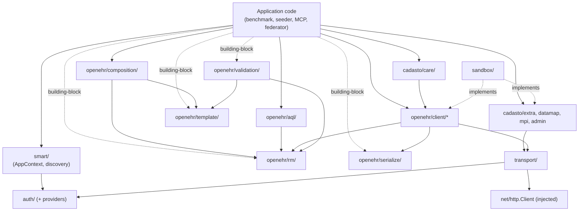
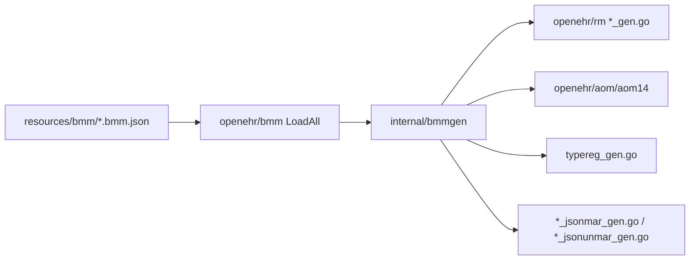

# Architecture

**Narrative companion to [`specs/`](../specs/).** This document describes the SDK's structure as prose and diagrams; the normative `MUST / SHOULD / MAY` statements live in [`specs/`](../specs/). When the two disagree, `specs/` wins and this document is the one to update.

> **Status: early implementation.** BMM loader, codegen, type registry, canonical JSON, canonical XML, `transport/`, auth providers (`clientcreds`, `jwtbearer`, `basic`), `smart/discovery/`, and openEHR REST clients (`openehr/client/system`, `openehr/client/ehr` read/write, `openehr/client/definition` ADL 1.4) are landed. `auth/smart` PKCE, Query (AQL), composition builder, and Cadasto extras remain stubs or open. Sections below describe both the intended shape and what runs today (`make test`, `make codegen`).

## Where to find what

| Need | Place |
|---|---|
| Requirement registry (REQ-NNN index) | [`../specs/REQ.md`](../specs/REQ.md) |
| Traceability index (machine-readable) | [`../specs/traceability.yaml`](../specs/traceability.yaml) |
| Packaging (REQ-001–005) | [`../specs/packaging.md`](../specs/packaging.md) |
| Glossary | [`../specs/glossary.md`](../specs/glossary.md) |
| In / out of scope | [`../specs/scope.md`](../specs/scope.md) |
| Package taxonomy + dependency rules (normative) | [`../specs/module-layout.md`](../specs/module-layout.md) |
| Idiomatic Go surface rules | [`../specs/idiom.md`](../specs/idiom.md) |
| RM modeling rules | [`../specs/rm-modeling.md`](../specs/rm-modeling.md) |
| Auth & SMART-on-openEHR contract | [`../specs/auth.md`](../specs/auth.md) |
| Wire format (REST, AQL, canonical JSON, FLAT, STRUCTURED) | [`../specs/wire.md`](../specs/wire.md) |
| Transport (retry, OTel, TLS posture) | [`../specs/transport.md`](../specs/transport.md) |
| Service discovery flow | [`../specs/service-discovery.md`](../specs/service-discovery.md) |
| Cross-SDK conformance probes (PROBE-NNN) | [`../specs/conformance.md`](../specs/conformance.md) |
| Use cases — primary, building-block, POC | [`../specs/use-cases.md`](../specs/use-cases.md) |
| Open research strands (STRAND-NN) | [`../specs/research-strands.md`](../specs/research-strands.md) |
| Closed architectural decisions | [`adr/`](adr/) |
| Implementation plans (per phase) | [`plans/`](plans/) |

## Package layout (summary)

The full taxonomy with package-level scope notes lives in [`../specs/module-layout.md`](../specs/module-layout.md). Landed packages are listed in [Current implementation](#current-implementation); remaining leaves are stubs or planned.

```
openehr-sdk-go/
├── auth/             smart/  clientcreds/  jwtbearer/  basic/
├── transport/
├── openehr/
│   ├── rm/           typereg/
│   ├── serialize/
│   ├── validation/
│   ├── template/
│   ├── aql/
│   ├── composition/
│   └── client/       ehr/  query/  definition/  demographic/  system/
├── smart/            discovery/
├── sandbox/
├── testkit/
├── cadasto/          extra/  datamap/  care/  mpi/  admin/
├── cmd/examples/
└── internal/
```

## Dependency direction



Normative rules: REQ-010 through REQ-014 in [`../specs/REQ.md`](../specs/REQ.md).

## Why it's shaped this way (narrative)

### Two cut lines, two purposes

The package tree has two named boundaries:

- **The `cadasto/` cut line** (REQ-010, REQ-011) — preserves the option of extracting Cadasto-platform extras into a sibling Go module later. Open question tracked in STRAND-08. The cut is held now regardless of resolution, because reversing it after v1 ships is expensive.
- **The building-block boundary** (REQ-013) — `openehr/rm`, `openehr/serialize`, `openehr/validation`, `openehr/template`, and `openehr/aql` (models only) must work *without* `transport/` or `auth/`. CI validators, FHIR-mapping prototypes, and AQL linters don't need HTTP; the SDK must not force the dependency.

The first cut is about future-proofing module structure; the second is about present-day consumer ergonomics.

### Idiomatic Go, not a PHP port

The PHP SDK uses repositories + exceptions; this SDK uses package-level functions + typed errors + `context.Context`-first + injected `*http.Client` + functional options. Cross-SDK parity is enforced at the **wire** (the bytes on the HTTP request, the AQL string), not at the source level (REQ-080, REQ-081). Two consumers picking the same logical operation will produce byte-identical HTTP traffic; they will not produce similar-looking source code.

### Type registry, not reflection

openEHR's RM has deep polymorphism (LOCATABLE → ENTRY → COMPOSITION; DATA_VALUE → DV_QUANTITY). Go does not have inheritance. The SDK solves this with concrete structs + embedded base structs + interfaces for abstract categories + a central type registry for `_type` decoding (REQ-030..040). No reflection-heavy tag-magic, no "generic RM node" superset type.

### Discovery is first-class

The SDK does not take a "base URL". It takes a `smart/discovery.ServiceCatalog` (REQ-070). For non-discovering backends — a static EHRbase deployment, a local CDR for testing — consumers build the catalog by hand without invoking a discovery transport.

### `internal/` is invisible

Anything under `internal/` is excluded from BC promises (REQ-005). Today this holds generator tooling: `internal/bmmgen` (RM/AOM/canonical JSON emission) and `internal/bmmdiff` (BMM corpus diff for version bumps). When in doubt about whether a helper belongs in a public package or `internal/`, ask: "would a consumer write a meaningful caller against this directly?" If no, it goes in `internal/`; if yes, it goes in a named public package.

## Current implementation

| Area | Location | Notes |
|---|---|---|
| Pinned BMM corpus | [`resources/bmm/`](../resources/bmm/) | Six `openehr_*.bmm.json` files; see [ADR 0001](adr/0001-bmm-version-bump-runbook.md) |
| BMM loader | [`openehr/bmm/`](../openehr/bmm/) | `LoadAll`, `FSResolver`, descendant-shadows-ancestor merge |
| Code generator | [`internal/bmmgen/`](../internal/bmmgen/), [`cmd/bmmgen`](../cmd/bmmgen) | `make codegen` / `make codegen-verify` (chained in `make test`) |
| Generated RM | [`openehr/rm/`](../openehr/rm/) | `*_gen.go`, `*_jsonmar_gen.go`, `*_jsonunmar_gen.go`, `typereg_gen.go` |
| Generated AOM 1.4 | [`openehr/aom/aom14/`](../openehr/aom/aom14/) | One-way import of `rm` for base types |
| Type registry | [`openehr/rm/typereg/`](../openehr/rm/typereg/) | Hand-written `Registry`; registrations in `typereg_gen.go` per ADR 0002 |
| Canonical JSON | [`openehr/serialize/canjson/`](../openehr/serialize/canjson/) | REQ-052; PROBE-030/031 |
| Canonical XML | [`openehr/serialize/canxml/`](../openehr/serialize/canxml/) | REQ-056; PROBE-033/034; `xsi:type` dispatch via typereg; `archetype_node_id` as XSD attribute |
| Transport | [`transport/`](../transport/) | REQ-021, 054, 059, 066, 090–094 |
| Auth | [`auth/`](../auth/), [`auth/clientcreds/`](../auth/clientcreds/), [`auth/jwtbearer/`](../auth/jwtbearer/), [`auth/basic/`](../auth/basic/) | REQ-060, 066, 068, 069 |
| Discovery | [`smart/discovery/`](../smart/discovery/) | REQ-070–072, 092 |
| REST clients | [`openehr/client/system/`](../openehr/client/system/), [`openehr/client/ehr/`](../openehr/client/ehr/) (+ composition, ehrstatus, directory, contribution) | REST plan Phases 2–4; PROBE-010–012 |
| Conformance probes | [`testkit/probes/`](../testkit/probes/) | `serialize/` (030–031, 033–034), `versioned/` (010–012) |

### BMM codegen pipeline



Load-bearing structural choices (flat packages, merge policy, typereg placement, abstract flattening, AOM→RM import, function stubs) are recorded in [ADR 0002 — BMM codegen decisions](adr/0002-bmm-codegen-decisions.md). Normative conformance rules remain in [`specs/bmm-conformance.md`](../specs/bmm-conformance.md).

## Versioning

Semver via standard Go module versioning. Module path locked at `github.com/cadasto/openehr-sdk-go` (REQ-001, STRAND-07 resolved). `v2`+ would live under `…/v2/` per Go's semantic-import-versioning convention. The version-bump rules per change kind are in [`../specs/module-layout.md § Versioning`](../specs/module-layout.md#versioning).

## Open decisions

Tracked in [`../specs/research-strands.md`](../specs/research-strands.md). STRAND-07 resolved (versioning + module path); STRAND-04 partially resolved (EVENT + numeric wire — ADRs 0003–0004). Four ADRs Accepted under [`adr/`](adr/). Resolutions become ADRs here.
