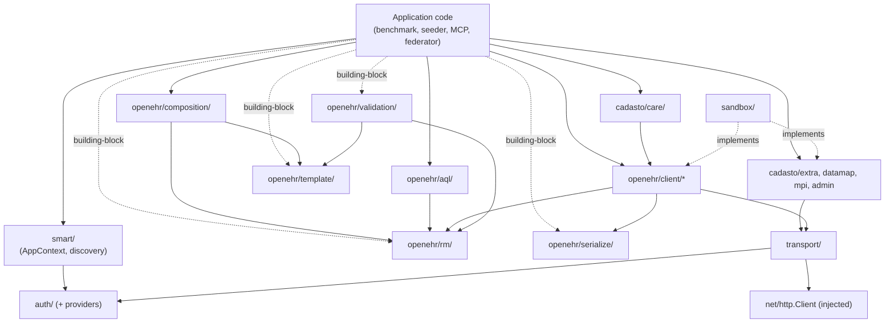
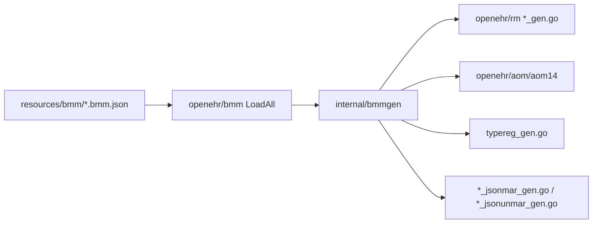

# Architecture

**Narrative companion to [`docs/specifications/`](../docs/specifications/).** This document describes the SDK's structure as prose and diagrams; the normative `MUST / SHOULD / MAY` statements live in [`docs/specifications/`](../docs/specifications/). When the two disagree, `docs/specifications/` wins and this document is the one to update.

> **Status: early implementation (pre-1.0).** A large surface is landed — BMM codegen, RM types + registry, canonical JSON/XML, `transport/`, the auth providers (`clientcreds`, `jwtbearer`, `basic`, `smart`), `smart/discovery` + launch context, the openEHR REST clients, and the ADL 1.4 template / validation / instance / composition stack. The composition/AQL *builders*, SMART App Registration, and the `cadasto/*` extras are open. Authoritative landed-vs-planned matrix: [`roadmap.md`](roadmap.md).

## Where to find what

| Need | Place |
|---|---|
| Requirement registry (REQ-NNN index) | [`../docs/specifications/REQ.md`](../docs/specifications/REQ.md) |
| Traceability index (machine-readable) | [`../docs/specifications/traceability.yaml`](../docs/specifications/traceability.yaml) |
| Packaging (REQ-001–005) | [`../docs/specifications/packaging.md`](../docs/specifications/packaging.md) |
| Glossary | [`../docs/specifications/glossary.md`](../docs/specifications/glossary.md) |
| In / out of scope | [`../docs/specifications/scope.md`](../docs/specifications/scope.md) |
| Package taxonomy + dependency rules (normative) | [`../docs/specifications/module-layout.md`](../docs/specifications/module-layout.md) |
| Idiomatic Go surface rules | [`../docs/specifications/idiom.md`](../docs/specifications/idiom.md) |
| RM modeling rules | [`../docs/specifications/rm-modeling.md`](../docs/specifications/rm-modeling.md) |
| Auth & SMART-on-openEHR contract | [`../docs/specifications/auth.md`](../docs/specifications/auth.md) |
| Wire format (REST, AQL, canonical JSON, FLAT, STRUCTURED) | [`../docs/specifications/wire.md`](../docs/specifications/wire.md) |
| Transport (retry, OTel, TLS posture) | [`../docs/specifications/transport.md`](../docs/specifications/transport.md) |
| Service discovery flow | [`../docs/specifications/service-discovery.md`](../docs/specifications/service-discovery.md) |
| openEHR conformance probes (PROBE-NNN) | [`../docs/specifications/conformance.md`](../docs/specifications/conformance.md) |
| Use cases — primary and building-block | [`../docs/specifications/use-cases.md`](../docs/specifications/use-cases.md) |
| Open research strands (STRAND-NN) | [`../docs/specifications/research-strands.md`](../docs/specifications/research-strands.md) |
| Closed architectural decisions | [`adr/`](adr/) |
| Implementation plans (per phase) | [`plans/`](plans/) |

## Package organization

The package taxonomy — every package with its scope notes — is **normative in [module-layout.md § Package taxonomy](../docs/specifications/module-layout.md#package-taxonomy)**. This section gives the narrative shape, not a second copy of the tree.

The module resolves into three concentric layers, each usable without the one above it:

1. **Building blocks (no I/O).** `openehr/rm` (+ `typereg`, `rminfo`), `openehr/bmm`, `openehr/aom`, `openehr/serialize`, `openehr/template`, `openehr/validation`, `openehr/instance`, `openehr/composition`, and `openehr/aql` (models). Pure data structures and algorithms — decode a canonical JSON Composition, validate it against an OPT, build one from a template, render an AQL string. They never reach for the network and never import `transport/` or `auth/` (REQ-013), so a CI validator or a synthetic-data faker can depend on exactly one of them.
2. **The HTTP path.** `auth/` produces a `TokenSource`; `transport/` wraps the caller's injected `*http.Client` and layers auth, retry, OpenTelemetry, and the ITS-REST envelope onto it; `openehr/client/*` are the thin, typed leaf clients (System, EHR + sub-resources, Query, Definition, Admin) that call through `transport/` and decode with the codecs. `smart/discovery` supplies the `ServiceCatalog` that tells the transport where the openEHR REST base URL lives.
3. **Application & platform.** `smart/` adds SMART-on-openEHR launch context and ID-token validation on top of discovery; `cadasto/*` carries the platform extras (Extra API, Datamap, MPI, Care, admin health) behind the cut line described below.

### Dependency direction

Imports flow strictly downward — no upward or cyclic imports — defined normatively, with the per-edge invariants, in [module-layout.md § Dependency direction](../docs/specifications/module-layout.md#dependency-direction) (REQ-010..014). The same graph, visually:

**Life of a REST call.** A consumer constructs a `ServiceCatalog` (via `smart/discovery` or by hand), passes it plus an `*http.Client` to `transport.New`, and calls a leaf method such as `ehr.Create(ctx, client)`. The leaf builds the request URL from the catalog, hands it to `transport.Do`, which attaches the bearer token from the `TokenSource`, starts an OTel span, applies the retry policy, and sends it through the injected client. The response envelope is decoded by the canonical codecs into typed `openehr/rm` structs and returned with version metadata. Dependencies only ever point downward — nothing in a building block imports a client, and nothing in `openehr/`, `auth/`, `smart/`, or `transport/` imports `cadasto/`.

## Dependencies

The SDK is built for a minimal, auditable dependency surface:

Runtime dependencies are kept deliberately minimal and reviewed. The current set:

| Dependency | Scope | Rationale |
|---|---|---|
| `go.opentelemetry.io/otel`, `/trace` | `transport/` only | Distributed tracing (REQ-090). Pulls logr, xxhash transitively. |
| `github.com/antlr4-go/antlr/v4` | `openehr/aql/parse` only | AQL parser runtime — pure Go, no transitive deps (REQ-109, ADR [0007](adr/0007-aql-antlr-grammar-profile.md)). The generator (Java) is containerised, never on the build/test path. |
| `golang.org/x/oauth2` | `auth/smart` (+ probes) | RFC 7636 PKCE `code_verifier`/`code_challenge` generation; parity cross-check in PROBE-004 (ADR [0009](adr/0009-smart-auth-library-scope.md)). Token sources/refresh/errors are the SDK's own `auth` types. |
| `github.com/coreos/go-oidc/v3` | `smart/` (id-token verify) | ID-token verification for SMART App Launch (ADR [0009](adr/0009-smart-auth-library-scope.md)). |
| `github.com/go-jose/go-jose/v4` | `auth/jwtbearer`, `smart/idtoken` | JWS signing for `client_assertion` / JWT Bearer grant and JWK→`crypto.PublicKey` parsing (ADR [0009](adr/0009-smart-auth-library-scope.md)). Direct dependency; also required by `go-oidc/v3`. |

- **Everything else is the standard library** — `net/http` for the (injected) HTTP client, `encoding/json` and `encoding/xml` for the canonical codecs, and `context` threaded throughout.
- **Most building blocks pull zero external code.** Importing `openehr/rm`, `openehr/serialize/canjson`, `openehr/template`, or `openehr/validation` brings in no third-party packages at all. The exceptions are the OTel-carrying `transport/` path, the AQL lint path (`openehr/aql/parse` → ANTLR runtime; `openehr/aql/lint` and `validation.ValidateAQL` transitively), and the auth path (`auth/`, `smart/` → x/oauth2 + go-oidc + go-jose). This keeps CLI validators, fakers, and mapping prototypes lightweight and is the practical payoff of the building-block boundary (REQ-013).
- **No HTTP-client library** — the SDK wraps stdlib `net/http`.

## Integrating the SDK

The SDK exposes seams, not globals — every external resource is injected, which keeps it testable and lets one process serve many tenants:

- **Inject the `*http.Client`.** The SDK never allocates a transport; you own connection pooling, TLS posture, and timeouts. Production callers MUST supply a strict-mode client (see [SECURITY.md](../SECURITY.md)).
- **Provide a `ServiceCatalog`.** There is no "base URL" parameter. Use `smart/discovery` for SMART-discovering backends, or build a static catalog by hand for a fixed deployment (EHRbase, a local CDR) — REQ-070.
- **Wire a `TokenSource`.** Attach it once at construction (`transport.WithTokenSource`) or per-request via `context` (`auth.WithTokenSource`) for MCP / multi-tenant fan-out.
- **`context.Context` is the first argument** on every I/O method — cancellation, deadlines, and per-request auth all ride on it.
- **Building-block-only integration.** Import `openehr/rm` + `serialize`/`validation`/`template`/`aql` with no transport or auth at all — the right shape for CI gates, seeders, and FHIR-mapping prototypes.

Runnable wiring for both the building-block and REST paths is in [`quick-start.md`](quick-start.md) (§ Two integration paths) and the catalog in [`examples.md`](examples.md).

## Why it's shaped this way (narrative)

### Two cut lines, two purposes

The package tree has two named boundaries:

- **The `cadasto/` cut line** (REQ-010, REQ-011) — preserves the option of extracting Cadasto-platform extras into a sibling Go module later (open question in STRAND-08). The cut is held now regardless of resolution, because reversing it after v1 ships is expensive.
- **The building-block boundary** (REQ-013) — `openehr/rm`, `serialize`, `validation`, `template`, and `aql` (models only) must work *without* `transport/` or `auth/`. CI validators, FHIR-mapping prototypes, and AQL linters don't need HTTP; the SDK must not force the dependency.

The first cut is about future-proofing module structure; the second is about present-day consumer ergonomics.

### Idiomatic Go

The API is designed for Go — package-level functions, typed errors, `context.Context`-first, injected `*http.Client`, functional options. Correctness is defined at the **wire** (the HTTP bytes, the AQL string) against the openEHR spec (REQ-080), independent of any particular source shape.

### Type registry, not reflection

openEHR's RM has deep polymorphism (LOCATABLE → ENTRY → COMPOSITION; DATA_VALUE → DV_QUANTITY). Go has no inheritance. The SDK solves this with concrete structs + embedded base structs + interfaces for abstract categories + a central type registry for `_type` decoding (REQ-030..040). No reflection-heavy tag-magic, no "generic RM node" superset type.

### Discovery is first-class

The SDK does not take a "base URL". It takes a `smart/discovery.ServiceCatalog` (REQ-070). For non-discovering backends — a static EHRbase deployment, a local CDR for testing — consumers build the catalog by hand without invoking a discovery transport.

### `internal/` is invisible

Anything under `internal/` is excluded from BC promises (REQ-005). Today this holds generator tooling — `internal/bmmgen` (RM/AOM/canonical JSON emission) and `internal/bmmdiff` (BMM corpus diff for version bumps) — plus the compiled-template foundation: `internal/templatecompile` (parsed OPT → walker-friendly compiled form behind the builder and validator) and `internal/templateinstance` (template-driven RM instance synthesis). When in doubt whether a helper belongs in a public package or `internal/`, ask: "would a consumer write a meaningful caller against this directly?" If no, it goes in `internal/`.

## Code generation

The RM and AOM 1.4 types are generated from the pinned BMM corpus — the one piece of the build with real machinery behind it. Full landed inventory across every package is in [`roadmap.md`](roadmap.md); the structural pieces here are the codegen input/output:

| Area | Location | Notes |
|---|---|---|
| Pinned BMM corpus | [`resources/bmm/`](../resources/bmm/) | `openehr_*.bmm.json` files; see [ADR 0001](adr/0001-bmm-version-bump-runbook.md) |
| BMM loader | [`openehr/bmm/`](../openehr/bmm/) | `LoadAll`, `FSResolver`, descendant-shadows-ancestor merge |
| Code generator | [`internal/bmmgen/`](../internal/bmmgen/), [`cmd/bmmgen`](../cmd/bmmgen) | `make codegen` / `make codegen-verify` (chained in `make test`) |
| Generated RM | [`openehr/rm/`](../openehr/rm/) | `*_gen.go`, `*_jsonmar_gen.go`, `*_jsonunmar_gen.go`, `typereg_gen.go` |
| Generated AOM 1.4 | [`openehr/aom/aom14/`](../openehr/aom/aom14/) | One-way import of `rm` for base types |
| Type registry | [`openehr/rm/typereg/`](../openehr/rm/typereg/) | Hand-written `Registry`; registrations in `typereg_gen.go` per [ADR 0002](adr/0002-bmm-codegen-decisions.md) |
| RM structural lookup | [`openehr/rm/rminfo/`](../openehr/rm/rminfo/) | BMM-derived `lookup_gen.go`; [ADR 0005](adr/0005-compiled-template-foundation.md) |

Load-bearing structural choices (flat packages, merge policy, typereg placement, abstract flattening, AOM→RM import, function stubs) are recorded in [ADR 0002 — BMM codegen decisions](adr/0002-bmm-codegen-decisions.md). The generator additionally emits the LOCATABLE identity surface — `Get*/Set*` accessors widening the sealed `rm.Locatable` plus `rm.MutableLocatable`, and the reverse registry `rm.RMTypeName` / `rm.IsTypedNil` — per [ADR 0013](adr/0013-generated-locatable-identity-surface.md), replacing the hand-maintained lock-step identity switches. Normative conformance rules are in [`docs/specifications/bmm-conformance.md`](../docs/specifications/bmm-conformance.md).

## Versioning

Standard Go module versioning; module path locked at `github.com/cadasto/openehr-sdk-go` (REQ-001), with `v2`+ under `…/v2/` per Go's semantic-import-versioning convention. Policy, bump rules, and the `v1.0.0` gate: [`releases.md`](releases.md) and [`module-layout.md` § Versioning](../docs/specifications/module-layout.md#versioning).

## Open decisions

Tracked in [`research-strands.md`](../docs/specifications/research-strands.md); resolutions become ADRs under [`adr/`](adr/). Don't settle a strand in code — surface it or draft an ADR first.

