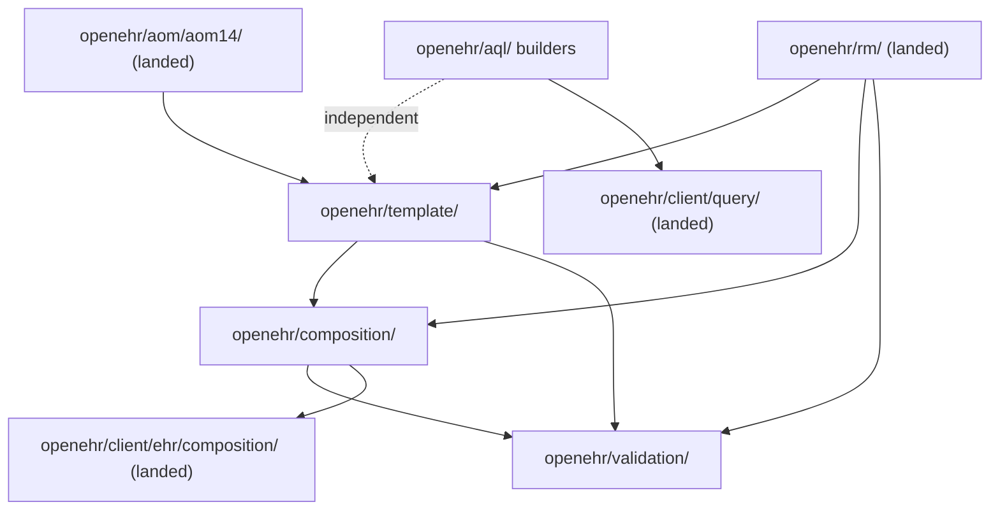

# Plan — Phase 2 clinical building blocks (umbrella)

**Date:** 2026-05-21
**Status:** Draft
**Owner:** SDK maintainers
**Covers:** Phase 2 milestone ([`../roadmap.md`](../roadmap.md)); REQ-013, REQ-014; cross-links REQ-055 (AQL), REQ-053 (FLAT/STRUCTURED — deferred here)
**Probes:** PROBE-020, PROBE-021 (AQL); new probe IDs reserved per child plan
**Implementation:** planned
**Depends on:** [`2026-05-15-bmm-codegen.md`](2026-05-15-bmm-codegen.md); [`2026-05-15-canonical-json-serialization.md`](2026-05-15-canonical-json-serialization.md); [`2026-05-15-rest-api-client.md`](2026-05-15-rest-api-client.md) Phases 1–6 (EHR + Query + Definition templates landed)
**Defers:** REQ-053 FLAT/STRUCTURED codecs; AOM 2.4 / ADL2 template upload; Cadasto `cadasto/*`; full cross-SDK probe ratification (REQ-080–081)

## Goal

Land the four **building-block** packages that sit between generated RM/AOM types and application code — without requiring `transport/` or `auth/`. Consumers (benchmark seeder, MCP tools, CI validators, clinical-modelling repos) can parse OPTs, build Compositions in memory, validate against constraints, and construct canonical AQL strings before any REST call.

This umbrella plan sequences work and records shared rules. **Implementation detail lives in the child plans** — do not implement from this file alone.

## Child plans (read in order)

| Order | Plan | Package | Blocks |
|---|---|---|---|
| 1 | [`2026-05-21-template-parser.md`](2026-05-21-template-parser.md) | `openehr/template/` | composition, validation |
| 2 | [`2026-05-21-composition-builder.md`](2026-05-21-composition-builder.md) | `openehr/composition/` | validation (partial) |
| 3 | [`2026-05-21-validation.md`](2026-05-21-validation.md) | `openehr/validation/` | — |
| 4 | [`2026-05-21-aql-builders.md`](2026-05-21-aql-builders.md) | `openehr/aql/` (builders) | — |

Executor for AQL is **already landed** at `openehr/client/query/` ([`2026-05-15-rest-api-client.md`](2026-05-15-rest-api-client.md) Phase 5). Phase 2 item 4 adds **builders only** on top of existing wire models (`Query`, `ResultSet`).

## Dependency graph

**Invariants** ([`specs/module-layout.md`](../../specs/module-layout.md)):

- `openehr/validation/` **MUST NOT** import `openehr/serialize/` — validate in-memory RM, not wire bytes.
- `openehr/template/` **MUST NOT** import `transport/`, `auth/`, or `openehr/client/*`.
- Template-specific generated structs (per-OPT Go types) **MUST NOT** live in `openehr/composition/` — consuming projects only ([`specs/scope.md`](../../specs/scope.md)).

## Integration with landed stack

| Piece | Location | Role for Phase 2 |
|---|---|---|
| AOM 1.4 generated types | `openehr/aom/aom14/` | Constraint / archetype model inside parsed OPT |
| RM + typereg | `openehr/rm/`, `openehr/rm/typereg/` | Composition builder targets; polymorphic slots |
| Canonical JSON | `openehr/serialize/canjson/` | Used by **clients** when persisting — not by validation |
| Definition template upload | `openehr/client/definition/` | Deploy OPT bytes to CDR; **distinct** from local OPT parse |
| Composition CRUD | `openehr/client/ehr/composition/` | Persists `*rm.Composition` built by `openehr/composition/` |
| AQL wire + execute | `openehr/aql/`, `openehr/client/query/` | Models landed; builders are the gap |

## Normative gaps to close (before or during Phase 0 of each child)

Several Phase 2 behaviours are described in [`specs/module-layout.md`](../../specs/module-layout.md) and [`specs/scope.md`](../../specs/scope.md) but lack dedicated REQ-NNN rows in [`specs/REQ.md`](../../specs/REQ.md). Each child plan lists proposed REQ IDs / spec locations to add when implementation starts — **do not invent REQ numbers in code without updating the registry**.

| Topic | Current anchor | Child plan |
|---|---|---|
| ADL 1.4 OPT parse + paths | scope + module-layout | template (package); `OperationalTemplate` type |
| Generic composition builder | module-layout + rm-modeling sketch | composition |
| Validation surfaces | module-layout + validation `doc.go` | validation |
| AQL dual builders | [`specs/wire.md` § REQ-055](../../specs/wire.md#req-055--wire-boundary) | aql-builders |

## Cross-cutting delivery rules

1. **Building-block independence (REQ-013).** Each package must be demo-able from `cmd/examples/` or tests without `transport.New`.
2. **Package-level API (REQ-023).** Prefer functions + options; optional `Repository` only where the REST client already established the pattern.
3. **No reflection for type dispatch (REQ-024).** Template/composition paths use generics or closed switches over known RM categories — not `reflect` for clinical data.
4. **Traceability.** Land code → update [`specs/traceability.yaml`](../../specs/traceability.yaml) + [`specs/REQ.md`](../../specs/REQ.md) in the **same PR** as the child plan phase completes.
5. **Probes.** Sandbox-first probes under `testkit/probes/{template,composition,validation,aql}/` when wire assertions exist; ratification (REQ-081) stays out of scope until PHP SDK parity.

## Umbrella progress

| Child plan | Phase 0 (spec/fixtures) | Phase 1 (MVP) | Phase 2 (hardening) | Status |
|---|---|---|---|---|
| OPT parser (`openehr/template/`) | | | | **Open** |
| Composition builder | | | | **Open** |
| Validation | | | | **Open** |
| AQL builders | | | | **Open** (wire models **Done**) |

Update this table when a child plan phase lands; [`../roadmap.md`](../roadmap.md) milestone **Phase 2** flips when all four child Phase 1 rows are **Done**.

## Out of scope (entire Phase 2 umbrella)

- **REQ-053 FLAT/STRUCTURED** — separate plan after canonical codecs; composition builder may later accept FLAT maps as input once REQ-053 exists.
- **AOM 2.4 / ADL2** — BMM pinned; no codegen ([`specs/scope.md`](../../specs/scope.md)).
- **Terminology validation** — no typed TERM client in v1.
- **Full OPT constraint engine parity with Archie/Linker** — v1 targets CDR-relevant constraint checks, not every ADL semantic rule.
- **Codegen of per-template Go structs** — consumer responsibility.
- **OET (`.oet`) parsing** — authoring templates; v1 assumes callers already have `.opt` ([template plan](2026-05-21-template-parser.md)).

## Mapping to specs

- [`specs/module-layout.md`](../../specs/module-layout.md) — package taxonomy and dependency direction
- [`specs/scope.md`](../../specs/scope.md) — in/out of v1
- [`specs/wire.md`](../../specs/wire.md) — REQ-055 (AQL), REQ-053 (deferred)
- [`specs/conformance.md`](../../specs/conformance.md) — PROBE-020, PROBE-021
- [`specs/use-cases.md`](../../specs/use-cases.md) — seeder, MCP, building-block cases
