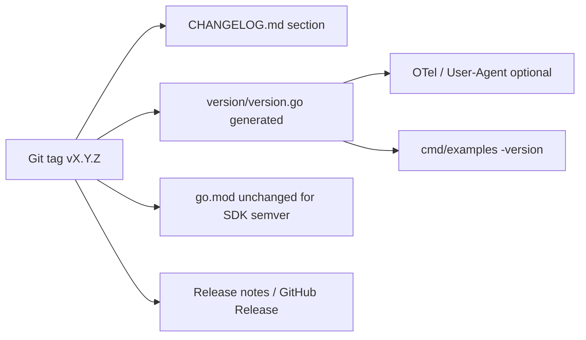

# Plan — Versioning and release strategy

**Date:** 2026-05-25
**Status:** Phase 0 landed (`v0.1.0` released 2026-05-26); Phase 1 (runtime `version` package) **declined** per maintainer call (YAGNI — git tag is the authoritative version source; runtime introspection is a deferred follow-up if a consumer asks); Phase 2 (release GitHub Action) + Phase 3 (`v1.0.0` ceremony) remain open
**Owner:** SDK maintainers
**Covers:** REQ-004 (semantic versioning), REQ-001 (module path); informs [`CHANGELOG.md`](../../CHANGELOG.md), [`docs/ci.md`](../ci.md), [`docs/releases.md`](../releases.md), [`CONTRIBUTING.md`](../../CONTRIBUTING.md), [`SECURITY.md`](../../SECURITY.md)
**Probes:** — (release process; no PROBE-NNN)
**Implementation:** Phase 0 **landed** (policy docs + first tag at `v0.1.0`); Phase 1 runtime package **declined**; Phases 2–3 planned
**Depends on:** [`docs/ci.md`](../ci.md); [`docs/specifications/packaging.md`](../specifications/packaging.md); [`docs/specifications/module-layout.md`](../specifications/module-layout.md) § Versioning
**Defers:** openEHR REST spec version (REQ-050), BMM file pins (REQ-041) as module semver — those ship as **compatibility metadata** per release, not as the Go tag itself

## Goal

Define how `github.com/cadasto/openehr-sdk-go` is versioned, how that version is **declared** (docs + machine-readable), **stamped** (git tags, optional build metadata), and **released** (automation + gates), from today’s pre-tag state through `v1.0.0` and beyond.

---

## Brainstorm — what we are versioning

The repo carries **four different “version” concepts**. Conflating them causes consumer confusion and bad release notes.

| Layer | What it pins | Example today | Changes when |
|--------|----------------|---------------|------------|
| **A. Go module semver** | Public API + wire behaviour consumers depend on | *No tag yet* (`[Unreleased]` only) | Every release tag `vX.Y.Z` |
| **B. Go toolchain** | Minimum Go compiler | `go 1.25.0` in `go.mod` | N-1 policy (REQ-002); bump in **minor** when raised |
| **C. openEHR wire contract** | REST / ITS behaviour | `1.1.0-development` (REQ-050) | Discovery mismatch fails fast; not the module tag |
| **D. BMM / codegen corpus** | Generated RM/AOM shapes | `openehr_rm_1.2.0`, `openehr_base_1.3.0`, … | BMM bump per [ADR 0001](../adr/0001-bmm-version-bump-runbook.md); may force **minor** if generated types change |

**Recommendation:** Tag and changelog track **A** only. Embed **B–D** as **compatibility metadata** shipped with each release (see § Stamping).

---

## Strategic choice: stay on `v0.x` until the v1.0.0 gate

Normative gate from [`docs/specifications/module-layout.md` § Versioning](../specifications/module-layout.md#versioning):

`v1.0.0` when:

1. All REQs in the catalog are `Status: Stable`.
2. The probe set reaches **parity** with the PHP SDK (REQ-080/081).
3. A reference Cadasto deployment passes the live probe set.

**Today:** large surface is **landed** (transport, clients, codecs, template/validation stack), but REQ registry and probes are still largely **Draft**, roadmap phases 4–5 are incomplete, and `internal/templatecompile` is not yet public — so **`v1.0.0` is not honest yet**.

| Option | Pros | Cons |
|--------|------|------|
| **A. First tag `v0.1.0` now** | Real adopters can `go get @v0.1.0`; signals “usable but evolving” | Must communicate breaking changes allowed in `v0.x` minors |
| **B. Wait until v1.0.0** | Single “stable” story | No semver anchor for months; forks pin pseudo-versions |
| **C. `v0.1.0` + alpha/beta pre-releases** | Clear maturity ladder (`v0.1.0-alpha.1`) | More release-process overhead |

**Recommendation: Option A with optional C.**

- Cut **`v0.1.0`** at the first **adoption milestone** (suggested below) — not “every line in CHANGELOG”.
- Use **`v0.x.y`** until the three v1 gates above are met.
- Reserve **`v1.0.0`** for the explicit stability ceremony (REQ Stable sweep + probe ratification + live run).

Semver during `0.x`: per SemVer 2.0, `0.y.z` allows breaking changes in **minor** `y`. **Also document project policy:** during `v0.x`, treat **minor** as potentially breaking for public API until `v1.0.0`; **patch** is always safe. That matches Go ecosystem expectations for pre-1.0 modules.

---

## What triggers which semver bump (REQ-004, refined)

| Change | Bump | Notes |
|--------|------|-------|
| Breaking change to any exported symbol outside `internal/` | **Major** (`v0` → next major, or `v1+`) | Includes renamed types, removed funcs, changed error semantics consumers rely on |
| New exported package, func, type; new stable REQ | **Minor** | During `v0.x`, call out possible breaks in release notes |
| Bug fix preserving public contracts | **Patch** | |
| Only `internal/`, tests, docs, CI | **Patch** (or no tag if trivial) | |
| BMM bump that changes generated RM/AOM public types | **Minor** (usually) | Often widespread; run `bmmdiff` + CHANGELOG |
| BMM bump with no public type change | **Patch** | Rare; verify with `make codegen-verify` |
| `go.mod` minimum Go version raise | **Minor** | REQ-002 |
| Spec `Draft` → `Stable` | **Minor** | Per module-layout table |
| Module path change | **Major** + `/v2/` import path | REQ-001; only if ever needed |

**Breaking-change definition for this SDK** (document in `docs/releases.md`):

- Renaming or removing exported identifiers.
- Changing function signatures (including adding required parameters).
- Changing JSON/XML wire output for the same logical operation without a major bump (PROBE-030/033 guard this).
- Tightening validation from “pass” to “fail” on the same inputs → **minor** during `v0.x`, **major** after `v1.0.0` (document in release notes).

---

## Where the version is declared (single source of truth)



### 1. Git tag (authoritative)

- Format: **`v0.1.0`**, **`v0.2.0`**, …, **`v1.0.0`** (leading `v` required for Go modules).
- Annotated tags preferred (`git tag -a v0.1.0`).
- Tag **only** from `main` (or release branch) after `make ci` passes.
- Consumers pin: `go get github.com/cadasto/openehr-sdk-go@v0.1.0`.

`go.mod` does **not** contain the SDK’s own version — only the Go language version and dependencies.

### 2. CHANGELOG.md (human narrative)

Keep [Keep a Changelog](https://keepachangelog.com/) structure already in use.

| Phase | CHANGELOG rules |
|-------|------------------|
| **Pre-1.0 (`v0.x`)** | Only `### Added` under `[Unreleased]` (current policy). Fold fix-ups into Added or omit. |
| **From `v1.0.0`** | Enable `### Changed`, `### Fixed`, `### Removed`, `### Deprecated` per SemVer meaning. |

On each release:

1. Rename `## [Unreleased]` → `## [X.Y.Z] - YYYY-MM-DD`.
2. Open fresh `## [Unreleased]`.
3. Tag matches `X.Y.Z`.

Release notes stay **high-level** (artefact class, not per-REQ); REQ traceability stays in `traceability.yaml` and commit messages.

### 3. Machine-readable stamp — `version` package (recommended)

Add **`github.com/cadasto/openehr-sdk-go/version`** (small, stable):

```go
package version

// Version is the SDK release semver (without leading v).
const Version = "0.1.0"

// Module is the go module path (REQ-001).
const Module = "github.com/cadasto/openehr-sdk-go"

// BMM pins at release time (REQ-041) — not semver, compatibility metadata.
var BMM = struct {
    Base string
    RM   string
    AM14 string
}{Base: "openehr_base_1.3.0", RM: "openehr_rm_1.2.0", AM14: "openehr_am_1.4.0"}

// OpenEHRREST is the primary wire contract (REQ-050).
const OpenEHRREST = "1.1.0-development"

// String returns a diagnostic line for logs and User-Agent builders.
func String() string
```

**Generation:** not hand-edited on every commit — produced by **`scripts/release-stamp`** (or `make release-prepare VERSION=0.1.0`) at release time from:

- CLI argument / tag name
- `resources/bmm/*.json` schema IDs
- `git rev-parse --short HEAD` → optional `Revision` const

**Consumers:** `transport` MAY add `User-Agent: openehr-sdk-go/0.1.0` via `version.String()` (optional REQ or doc-only until requested).

**Alternative considered:** `-ldflags` only at link time — rejected as primary stamp because library consumers cannot read it; fine for `cmd/examples` only.

### 4. GitHub Releases

- Body: copy CHANGELOG section + compatibility table (Go ≥1.25, BMM pins, REST pin).
- Attach nothing binary (library module).
- Link to `docs/ci.md` and milestone docs.

### 5. Spec / roadmap alignment (not semver)

- Do **not** encode SDK semver in `docs/specifications/` (operational, not wire contract).
- Update [`docs/roadmap.md`](../roadmap.md) milestone when cutting `v0.1.0` / `v1.0.0`.

---

## Release cadence and branching

| Element | Proposal |
|---------|----------|
| **Default branch** | `main` — always releasable after CI |
| **Cadence** | **On demand** for `v0.x` (milestone-driven); consider **monthly patch** once consumers exist |
| **Release branch** | Not required for `v0.x`; tag `main` directly. For `v1+`, optional `release/v1.x` only if cherry-picks needed |
| **Pre-releases** | Optional `v0.2.0-rc.1` tags for CDR/MCP adopters to test before `v0.2.0` |

**Hotfix:** `v0.1.1` from `main` (patch). If `main` has diverged, cherry-pick to a `release/v0.1` branch only if support window is promised (defer until `v1.0.0` policy).

---

## Automation (phases)

### Phase 0 — Policy docs (no automation)

**Tasks:**

1. Add [`docs/releases.md`](../releases.md) — semver rules, `v0.x` break policy, consumer pinning examples, v1.0.0 checklist link.
2. Link from [`README.md`](../README.md), [`AGENTS.md`](../AGENTS.md), [`docs/ci.md`](../ci.md).
3. Add row to [`docs/specifications/traceability.yaml`](../specifications/traceability.yaml) if a REQ for release stamping is desired (optional **REQ-107** “Release metadata package”).

**Definition of done:** Contributors know when to bump what without reading this plan.

### Phase 1 — `version` package + manual first tag

**Tasks:**

1. Implement `version/` with constants above + `TestConstantsMatchBMM` reading `resources/bmm/` filenames.
2. Add `scripts/release-stamp` (or Make target `release-stamp VERSION=x.y.z`) writing `version/version.go` and verifying clean git diff.
3. Document first tag checklist in `docs/releases.md`:
   - `make ci` green
   - `make spec-check` (subset) documented
   - CHANGELOG section filled
   - `version/` regenerated
   - Annotated tag `v0.1.0` on merge commit
4. Cut **`v0.1.0`** when milestone agreed (suggested scope below).

**Definition of done:** `go list -m -versions` resolves; `version.Version` matches tag.

### Phase 2 — GitHub Actions release workflow

**Tasks:**

1. `.github/workflows/release.yml` on `push` tags matching `v*`:
   - Verify tag is on a commit that passed CI (optional: check status API)
   - Run `make ci`
   - Run `scripts/release-stamp` with tag version
   - Fail if `version/version.go` not committed on release branch (or auto-commit bot — prefer **manual** stamp PR before tag)
2. `workflow_dispatch` dry-run: print would-be `version.String()` and CHANGELOG excerpt.
3. Optional: `govulncheck` before tag (align with `docs/ci.md` future work).

**Definition of done:** Pushing tag runs verification; humans still decide when to tag.

### Phase 3 — v1.0.0 ceremony

**Tasks:**

1. REQ registry sweep: move landed REQs to `Status: Stable` in specs.
2. PROBE ratification vs PHP SDK + live deployment runbook.
3. Promote CHANGELOG to full Added/Changed/Fixed/Removed.
4. Tag **`v1.0.0`**; announce API stability promise (no breaking changes without major bump).
5. ADR if needed: “v1.0.0 scope boundary” (what is in vs deferred `cadasto/` extras).

---

## Suggested first tag: `v0.1.0` scope

Cut **`v0.1.0`** when the team agrees this is the **minimum credible adopter slice** (not “complete SDK”):

| In scope for `v0.1.0` | Out of scope (document as planned) |
|------------------------|-------------------------------------|
| Generated RM + AOM 1.4 + typereg | Public `template.Compile` (still internal) |
| canjson + canxml + cassettes | FLAT / STRUCTURED codecs |
| transport + auth providers + discovery | Full SMART App Registration (STRAND-05) |
| System, EHR, Query, Definition, Admin clients | Demographic client |
| OPT parse + `internal/templatecompile` + REQ-103 + REQ-102 v2 validation (in-repo) | `cadasto/*` application APIs |
| `make ci`, `version` package | Sandbox transport, live probe CI |

If validation or template compile must be **externally** callable before tag, defer tag until `template` public surface lands (ADR 0005 §C2) — that is a product decision, not a semver rule.

---

## Alignment with PHP SDK and Cadasto platform

| Topic | Proposal |
|-------|----------|
| **Wire parity** | Go `v0.x` tags are independent of PHP package version; **PROBE-NNN** is the coupling point. Document “compatible with PHP SDK ≥X” in release notes once PHP tags exist. |
| **Cadasto services** | Platform version ≠ SDK version. Discovery `spec_version` stays `1.1.0-development` (REQ-050). |
| **Changelog** | Separate repos — no lockstep tags unless agreed for marketing |

---

## Future: `v2` module path and `cadasto/` extraction

Per REQ-001 and STRAND-08:

- Extracting `cadasto/` to `github.com/cadasto/openehr-sdk-go-cadasto/v2` (hypothetical) is a **new major** with `/v2/` in the import path for the **core** module only if the **core** path breaks — extraction is a **new module**, not a minor bump on the monolith.
- Document in `docs/releases.md` when/if STRAND-08 resolves; do not block `v0.1.0` on extraction.

---

## Open decisions (resolve before Phase 1)

| # | Question | Recommendation |
|---|----------|----------------|
| 1 | Hand-edit `version/version.go` vs generate-only? | **Generate-only** at release; CI checks match tag |
| 2 | Include `Revision` git SHA in `version`? | **Yes** — invaluable for support |
| 3 | User-Agent / OTel SDK version attribute? | **Phase 1 doc**; wire in transport in Phase 2 if desired |
| 4 | Sign tags (Sigstore / GPG)? | **Nice-to-have** for `v1.0.0`; not blocking `v0.1.0` |
| 5 | Who may push tags? | Maintainers only; branch protection on `main` |

---

## Success criteria

- One obvious consumer pin: `go get github.com/cadasto/openehr-sdk-go@v0.1.0`.
- Runtime introspection: `version.Version` and BMM/REST pins match release notes.
- Release process documented in `docs/releases.md`; agents find it via README/AGENTS.
- `v1.0.0` remains a deliberate gate tied to REQ Stable + probes, not an arbitrary date.

---

## References

- [REQ-004](../specifications/packaging.md) — semantic versioning
- [module-layout.md § Versioning](../specifications/module-layout.md#versioning) — bump matrix, v1.0.0 gates
- [CHANGELOG.md](../../CHANGELOG.md) — pre-1.0 policy
- [docs/ci.md](../ci.md) — quality gate before tag
- [ADR 0001](../adr/0001-bmm-version-bump-runbook.md) — BMM bumps vs codegen
- Go modules: [Module version numbering](https://go.dev/doc/modules/version-numbers)
