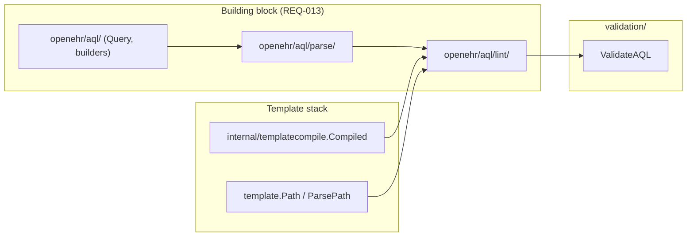

# Plan — AQL parse + lint (SDK grammar profile)

**Date:** 2026-06-15
**Status:** Draft
**Owner:** SDK maintainers
**Covers:** proposed **REQ-109** (AQL static lint); extends **REQ-102** (`ValidateAQL` entry point); informs **REQ-055** (builder round-trip checks); **PROBE-028** (reserved — see Phase 4)
**Probes:** PROBE-028 (new — AQL lint sandbox); PROBE-020 / PROBE-021 unchanged (builders + execute-time semantics)
**Implementation:** planned
**Depends on:** [`2026-05-21-aql-builders.md`](2026-05-21-aql-builders.md) (REQ-055 builders landed); [`archive/2026-05-22-template-req100-followups.md`](archive/2026-05-22-template-req100-followups.md) (compiled OPT + `template.Path`); [`archive/2026-05-24-composition-validation-template-driven.md`](archive/2026-05-24-composition-validation-template-driven.md) (validation `Result` / `Issue` model — REQ-102)
**Defers:** Full AQL pretty-printer; query optimiser; stored-query builder; live terminology resolution; CDR-grade path resolution (PROBE-021 territory); demographic validator (`ValidateDemographic` — separate track in archived validation plan)
**Blocked on (Phase 0 input):** Assemble `active/` grammar + `DIVERGENCES.md` per [§ SDK grammar profile](#sdk-grammar-profile) (five accepted deltas on QUERY Release-1.1.0 baseline).

## Goal

Ship a **building-block** parse + lint pipeline for hand-written, imported, or `NewQuery(literal)` AQL — without replacing the typed builders (REQ-055) or the CDR as semantic authority at execute time (PROBE-021).

Consumers: CI validators in clinical-modelling repos, MCP tools linting stored queries before upload, pre-flight checks on `ExecuteString` payloads, and `validation.ValidateAQL(q, compiledOPT)` for template-aware archetype/path checks.

**Non-goals:** Accept every syntactically valid AQL 1.1.0 query the CDR would run; reject only what the lint contract defines. Syntax floor is the **SDK-maintained grammar profile** (foundation AQL 1.1.0 + documented corrections), not a live pull from specifications.openehr.org on every build.

---

## Strategic choice — ANTLR vs hand-written subset

| Option | Pros | Cons | Verdict |
|---|---|---|---|
| **A. ANTLR + in-repo `.g4` (SDK grammar profile)** | Spec-shaped syntax; generated parser; corrections versioned with the SDK | New dependency (`github.com/antlr4-go/antlr`); generated code; known foundation grammar bugs require a fork policy | **Recommended** |
| **B. Hand-written recursive-descent (OPT-path style)** | Zero ANTLR dep; tiny binary | Drifts from AQL spec; re-implements predicate/path rules; high maintenance | **Reject** |

**Decision (proposed ADR 0007):** **Option A** — the **active** grammars live in this repo under `resources/aql/grammar/`; `make aqlgen` generates Go into `openehr/aql/parse/gen/`. The foundation [QUERY Release-1.1.0](https://specifications.openehr.org/releases/QUERY/Release-1.1.0/docs/AQL/grammar/AqlParser.g4) release is **provenance only** (frozen baseline copy + divergence log), not the runtime source of truth.

**Explicit non-dependencies:**

- **Do not** import or CI-pin [openEHR/openEHR-antlr4 `test_fixtures`](https://github.com/openEHR/openEHR-antlr4/tree/master/test_fixtures) — tests are **in-repo only** (see § Testing strategy).
- **Do not** treat `openEHR-antlr4` `reader_aql` as a merge source unless a maintainer manually reconciles during a grammar bump (optional reference, not a build input).

---

## Grammar deviation policy (foundation bugs → SDK profile)

The published QUERY **Release-1.1.0** `AqlLexer.g4` / `AqlParser.g4` are the semantic baseline. This track ships a documented **SDK grammar profile**: foundation plus `SDK-AQL-NNN` deltas (see [§ SDK grammar profile](#sdk-grammar-profile)).

### Layout under `resources/aql/grammar/`

```
resources/aql/grammar/
├── README.md                 # licence, bump procedure, pointer to ADR 0007
├── baseline/                 # frozen upstream snapshot (read-only reference)
│   ├── PIN                 # specifications-QUERY git tag + SHA for Release-1.1.0
│   ├── AqlLexer.g4
│   └── AqlParser.g4
├── active/                   # what `make aqlgen` consumes (SDK grammar profile)
│   ├── AqlLexer.g4         # maintainer-supplied corrected files land here
│   └── AqlParser.g4
└── DIVERGENCES.md            # numbered SDK-AQL-NNN entries (required per fix)
```

**Rule:** `active/` is the only input to codegen. `baseline/` never changes except when rebasing onto a new QUERY release. Every delta between `baseline/` and `active/` **MUST** have a row in `DIVERGENCES.md`.

### `DIVERGENCES.md` entry shape (one per bugfix)

```markdown
### SDK-AQL-001 — <short title>

- **Upstream:** QUERY Release-1.1.0 `AqlParser.g4` (or Lexer) — `<rule/token>`
- **Symptom:** <what fails or mis-parses with foundation grammar>
- **Fix:** <one-line summary of grammar change>
- **Regression:** `openehr/aql/parse/testdata/grammar/sdk-aql-001_<slug>.aql` (+ optional `.reject` sibling)
- **Upstream status:** open | fixed-in-QUERY-x.y | wontfix
- **Notes:** <link to foundation PR / ticket if any>
```

Numbering is stable (`SDK-AQL-NNN`); never reuse IDs. REQ-109 prose cites “syntax per SDK grammar profile documented in `resources/aql/grammar/DIVERGENCES.md`”.

### How you supply the fixed grammar (Phase 0 gate)

1. **Drop corrected** `AqlLexer.g4` and `AqlParser.g4` into `resources/aql/grammar/active/` (or open a PR with them).
2. **Populate `baseline/`** once from [specifications-QUERY tag `Release-1.1.0`](https://github.com/openEHR/specifications-QUERY/tree/Release-1.1.0/docs/AQL/grammar) if not already present.
3. **Write `DIVERGENCES.md`** — one `SDK-AQL-NNN` block per accepted delta (five entries; see § SDK grammar profile).
4. **Add one minimal `.aql` file per divergence** under `openehr/aql/parse/testdata/grammar/` proving the fix (parse succeeds or fails as intended).
5. **ADR 0007** lists the policy above; it does not duplicate per-bug prose (that stays in `DIVERGENCES.md`).

Optional maintainer tooling (Phase 0): `scripts/aql-grammar-diff.sh` prints a unified diff `baseline/` → `active/` for PR review — not required for v1.

### Rebasing when QUERY ships a new release

Mirror [ADR 0001](adr/0001-bmm-version-bump-runbook.md) spirit:

1. Import new upstream `.g4` into `baseline/` (new `PIN`).
2. Re-apply or drop each `SDK-AQL-NNN` fix: if upstream absorbed the fix, remove the divergence row and merge `active/` toward baseline.
3. Re-run `make aqlgen` + `make aqlgen-verify` + full `openehr/aql/parse/...` tests.
4. Note grammar profile bump in CHANGELOG (artefact class: “AQL grammar profile”).

### Licence

Foundation grammars are **CC-BY-SA 4.0**. `resources/aql/README.md` attributes openEHR Foundation; SDK corrections are documented derivative work under the same licence terms.

**QUERY version note:** SDK REST pin is `1.1.0-development`; AQL stable release is **1.1.0**. The SDK profile is “**AQL 1.1.0 + SDK-AQL-NNN corrections**”, not necessarily byte-identical to any single CDR parser.

---

## SDK grammar profile

**Status:** Locked for Phase 0  
**Baseline:** QUERY Release-1.1.0 `AqlLexer.g4` / `AqlParser.g4` (frozen under `resources/aql/grammar/baseline/`).  
**Active:** `baseline/` plus the five deltas below (`resources/aql/grammar/active/`). Fork review is complete; only accepted changes are listed here. Rejected fork patterns are not re-litigated — optional one-liners may appear in `DIVERGENCES.md` § Considered and rejected.

### Design rationale — VERSION containment

Version predicates (`latest_version()`, `all_versions()`) belong on a **`VERSION` containment operand**, not on clinical RM classes (`OBSERVATION o[all versions()]`). The data tree (`COMPOSITION` → `OBSERVATION` …) is separate from version machinery (`VERSIONED_OBJECT` → `VERSION` → snapshot). Projecting `v/commit_audit/…` or ranging history requires `CONTAINS VERSION v[…]` (or `FROM VERSION v[…]`). The SDK profile **keeps the foundation grammar** for this — no `SDK-AQL-NNN` row.

**Lint / builder:** `OBSERVATION o[all versions()]` is a syntax error; REQ-055 emitters **SHOULD** add explicit `VERSION` + predicate when version metadata or history is needed (emit `[latest_version]` / `[all_versions]` explicitly until SPECPR-481 lands).

**Regression:** `version_on_class.reject` must not parse; `version_containment.aql` (`CONTAINS VERSION v[all_versions] CONTAINS COMPOSITION c`) must parse.

### Accepted deltas (`SDK-AQL-NNN`)

| ID | Area | Change from baseline | Regression fixture(s) |
|---|---|---|---|
| **SDK-AQL-001** | Lexer — string fn vs `CONTAINS` operator | Remove `CONTAINS` from `STRING_FUNCTION_ID`; add `CONTAINS_STR: C O N T A I N S '_' S T R` (longest-match safe vs containment `CONTAINS`; fallback `STR_CONTAINS` if `aqlgen` fails). Spec spelling `CONTAINS(expr, sub)` **not** accepted — use `CONTAINS_STR(expr, sub)`. | `contains_containment.aql`, `contains_str_fn.aql`, `contains_spec_fn.reject` |
| **SDK-AQL-002** | Parser — `selectExpr` | Add `SYM_ASTERISK` (`SELECT *`). | `select_star.aql` |
| **SDK-AQL-003** | Parser — `limitClause` | `limitOperand` = `INTEGER \| PARAMETER` for `LIMIT` / `OFFSET`; **no** reversed `OFFSET … LIMIT` order. | `limit_offset_param.aql`, `offset_before_limit.reject` |
| **SDK-AQL-004** | Lexer — `ESCAPE_SEQ` | Extend escapes with `\\"` and `\\*`. | `escape_quote_star.aql` (or inline in string-literal syntax tests) |
| **SDK-AQL-005** | Lexer — comments | `COMMENT → skip` (not `COMMENT_CHANNEL`). | — (parse-only; no behavioural test required) |

**SDK-AQL-001 lexer sketch:**

```antlr
CONTAINS_STR: C O N T A I N S '_' S T R ;
STRING_FUNCTION_ID: LENGTH | CONTAINS_STR | POSITION | SUBSTRING | CONCAT_WS | CONCAT ;
CONTAINS : C O N T A I N S ;   // containment operator — unchanged
```

**Phase 0:** Copy baseline → `active/`, apply the five deltas, mirror each row in `DIVERGENCES.md`, add fixtures under `openehr/aql/parse/testdata/grammar/`, run `make aqlgen-verify`.

### Baseline fidelity (no `SDK-AQL` row — foundation grammar unchanged)

- `VERSION` class operand + `versionPredicate`; full `pathPredicate` on `identifiedPath` / `pathPart`
- Standalone `[$param]` in predicates; `ORDER BY` long and short keywords; extension `IDENTIFIER(...)` functions
- Deprecated `TOP` in `selectClause` (foundation grammar retained; REQ-055 does not emit it)
- Compact and punctuated ISO8601 literals; `SYM_DOUBLE_DASH? EOF` on `selectQuery`; split `AqlLexer` / `AqlParser` for codegen

---

## Architecture



### Package boundaries

| Package | Responsibility | Imports |
|---|---|---|
| `openehr/aql/parse/` | `Parse(q string) (*Document, error)` — syntax only; positions for diagnostics | Generated ANTLR listeners + thin hand-written AST |
| `openehr/aql/lint/` | `Lint(doc, *LintOptions) Result` — semantic subset (paths, archetypes, parameters) | `parse/`, `openehr/template` (path grammar only), optionally `internal/templatecompile` via validation seam |
| `openehr/aql/` | Existing `Query`, builders, `NewQuery` — unchanged wire contract | May call `parse` for optional `Query.Lint()` helper |
| `openehr/validation/` | `ValidateAQL(q aql.Query, c *templatecompile.Compiled) Result` — bridges to shared `Issue` model (REQ-102) | `aql/lint/`, `internal/templatecompile` |

**REQ-013:** `openehr/aql/parse/` and `openehr/aql/lint/` **MUST NOT** import `transport/`, `auth/`, `openehr/client/*`, or `openehr/serialize/`. `lint` **MAY** import `openehr/template` for path validation (same as validation today).

**Codegen:** `internal/aqlgen/` + `cmd/aqlgen/` (or extend Makefile like `bmmgen`) — **not** public API. Generated parsers live in `openehr/aql/parse/internal/antlr/` or `openehr/aql/parse/gen/` (pick one; mirror `bmmgen` “generated subtree” pattern).

**Dependency:** add `github.com/antlr4-go/antlr/v2` — first non-OTel runtime dep justified for spec fidelity; document in ADR 0007 and `docs/architecture.md` dependencies table.

---

## Lint contract (normative target for REQ-109)

Lint **MUST** run collect-all (same spirit as REQ-102): return every issue, not fail-fast.

### Layer 1 — Syntax (grammar-backed)

- Input **MUST** parse as `selectQuery` per **`resources/aql/grammar/active/`** (SDK grammar profile).
- On failure: issue code `aql_syntax`, sentinel `aql.ErrSyntax` (new), `Issue.Path` empty, `Detail` carries ANTLR line/column.
- Empty / whitespace-only: `aql_empty` before parse (today `Query.Validate` only).

### Layer 2 — Shape (AST walk, no CDR)

| Check | Issue code | Rule |
|---|---|---|
| `SELECT` present with ≥1 projection | `aql_select` | |
| `FROM` present | `aql_from` | |
| `FROM`/`CONTAINS` tree has ≥1 `archetypePredicate` or `VERSION`/`EHR` entry with identifiable scope | `aql_from_archetype` | v1: at least one `openEHR-EHR-…` archetype HRID or `$param` in a predicate position |
| `$name` placeholders in `Q` **MUST** have matching keys in `Query.Parameters` (when linting `aql.Query`) | `aql_unbound_param` | Complements REQ-055 injection story |
| Parameters in map **MUST** appear in `Q` (warning or error — pick error for v1) | `aql_unused_param` | Optional v1.1 |

### Layer 3 — Path & template (only when `*templatecompile.Compiled` provided)

| Check | Issue code | Rule |
|---|---|---|
| Each `identifiedPath` in `SELECT` / `WHERE` (excluding alias roots) **MUST** use path segments parseable by the SDK’s **AQL path normaliser** (new: strip alias, map to `template.Path` or dedicated `aql.Path` type) | `aql_path_syntax` | Do **not** reuse OPT `NodeAt` directly — AQL paths are alias-qualified |
| When `c != nil`: each archetype HRID in `FROM`/`CONTAINS` **MUST** appear in `c.AllByArchetypeID()` (or index TBD on `Compiled`) | `aql_archetype_not_in_template` | From archived validation plan |
| When `c != nil`: normalised paths **SHOULD** resolve to a node in `c` (exact `NodeAt` on compiled AQL paths) | `aql_path_not_in_template` | **Warning** in v1 — CDR may still resolve paths the OPT compiler does not index (document false-positive policy) |

**Explicitly out of scope (v1):** terminology `TERMINOLOGY()`, function signatures, `MATCHES` value-set membership, version predicates beyond parse, `ORDER BY` type checking, execute-time `ErrPathResolution` (PROBE-021).

---

## Relationship to REQ-055 builders

| Concern | Builders | Parse + lint |
|---|---|---|
| Syntax errors | Impossible by construction (PROBE-021) | N/A for built queries |
| Canonicalisation | Single emitter (`PROBE-020`) | Optional **Phase 5** check: `Parse(builder.Build().Q)` succeeds + lint passes |
| Round-trip | **Deferred** | `Parse` → AST → **not** re-emit in v1 (no pretty-printer); optional future `aql.Format` |

**Phase 5 (optional):** Property test — for golden queries in `openehr/aql/testdata/wire/`, `Lint(Parse(q))` is clean; builder output lint-clean.

---

## Phases

### Phase 0 — ADR, grammar profile, codegen skeleton

**Outcome:** Accepted ADR 0007; `baseline/` + `active/` grammars + `DIVERGENCES.md`; `make aqlgen` / `make aqlgen-verify`; no public API yet.

**Prerequisite:** Apply [§ SDK grammar profile](#sdk-grammar-profile) to `active/`; fill `DIVERGENCES.md` (`SDK-AQL-001` … `005`) with matching `testdata/grammar/` cases.

**Tasks:**

1. **ADR 0007** — ANTLR dep; `baseline/` vs `active/`; divergence numbering; no external fixture deps; QUERY rebase procedure.
2. **`resources/aql/grammar/`** — layout per § Grammar deviation policy; `baseline/PIN` from specifications-QUERY `Release-1.1.0`.
3. **`DIVERGENCES.md`** — one `SDK-AQL-NNN` per fix (maintainer-authored with corrected grammar).
4. **`internal/aqlgen/`** — reads **`active/` only**; generates Go into `openehr/aql/parse/gen/`.
5. **`make aqlgen-verify`** — CI fails if generated output drifts.
6. **Smoke tests** — `openehr/aql/parse/testdata/grammar/` (per-divergence cases) + REQ-055 golden `testdata/wire/observations_by_archetype.aql`.

**Definition of done:** Corrected grammar committed; every divergence has a regression `.aql`; `make aqlgen-verify` green; ADR accepted.

---

### Phase 1 — Public parse API + syntax errors

**Outcome:** `openehr/aql/parse.Parse` returns a stable, hand-written AST (decorates ANTLR tree); positions for diagnostics.

**Tasks:**

1. **AST types** — `Document`, `SelectClause`, `FromExpr`, `ContainsExpr`, `IdentifiedPath`, `Predicate`, … (subset of grammar labels needed for lint + future format).
2. **Visitor** — ANTLR parse tree → AST; hide generated types from public API.
3. **`parse.Parse(string) (*Document, error)`** — wrap `AqlParser.selectQuery`; export `parse.SyntaxError` with offset/line/col.
4. **`aql.ErrSyntax`** in `openehr/aql/errors.go`; `errors.Is` contract.
5. **Tests** — table-driven valid/invalid strings in `openehr/aql/parse/testdata/` only (grammar regressions + hand-crafted syntax cases). **No** import of openEHR-antlr4 fixtures.

**Definition of done:** `go test ./openehr/aql/parse/...` green; golden AQL from REQ-055 parses.

---

### Phase 2 — Path normalisation + archetype extraction

**Outcome:** `lint.Extract(doc) Metadata` — archetype HRIDs, alias map, all `identifiedPath` strings, `$parameters` referenced.

**Tasks:**

1. **`lint.Metadata`** struct — extracted facts for validators and future tooling.
2. **Alias resolution** — walk `FROM`/`CONTAINS` binding `IDENTIFIER` → RM class / archetype predicate.
3. **Path normaliser** — `a/ehr_id/value` + `o/data/events/...` rules; document mapping to `template.Path` where the OPT path is suffix-compatible (see REQ-100 path subset).
4. **Unit tests** — paths from PROBE-020 golden; negative cases (unknown alias, trailing slash).

**Definition of done:** Extractor covered; no `Compiled` dependency yet.

---

### Phase 3 — `openehr/aql/lint` + `validation.ValidateAQL`

**Outcome:** REQ-109 normative text; `ValidateAQL` lands in `openehr/validation/`.

**Tasks:**

1. **`docs/specifications/wire.md` § REQ-109** (or `clinical-modeling.md` — pick one canonical home; wire.md already owns AQL section) — lint layers, issue codes, CDR non-authority disclaimer.
2. **`REQ.md` row + `traceability.yaml`** — `REQ-109`, packages, tests, link to this plan.
3. **`openehr/aql/lint.Lint(doc, *LintOptions) lint.Result`** — parallel `Issue` shape or convert to `validation.Issue` in thin wrapper.
4. **`validation.ValidateAQL(q aql.Query, c *templatecompile.Compiled) validation.Result`** — parse `q.Q`, run lint; map codes to `ErrAQLSyntax` via `Issue.Err()`.
5. **Update REQ-102** — remove “AQL lint deferred” under out-of-scope; point to REQ-109.
6. **`openehr/aql/doc.go`** — “parse, lint” no longer aspirational.
7. **Example** — `cmd/examples/lint-aql/main.go` (optional): load OPT + query file → print issues.

**Definition of done:** `ValidateAQL` tested with fixture OPT + hand-written AQL; `make spec-check` green.

---

### Phase 4 — PROBE-028 + conformance row

**Outcome:** Sandbox probe for lint stability (issue codes + paths).

**Tasks:**

1. **PROBE-028** — define in `conformance.md`: given fixture OPT + known-good / known-bad AQL strings, lint returns stable issue codes (mirror PROBE-025 style).
2. **`testkit/probes/aql/probe_028_aql_lint.go`** — sandbox-only; no transport.
3. **Cassettes** — `testkit/cassettes/aql/lint/` — `valid.aql`, `missing_archetype.aql`, `bad_syntax.aql`, expected issue JSON.

**Definition of done:** PROBE-028 Implemented (Sandbox); `make probe-status` shows Implemented.

---

### Phase 5 — Builder / grammar alignment (optional)

**Outcome:** Confidence that REQ-055 emitter ⊆ **SDK grammar profile**.

**Tasks:**

1. Property test: all builder-generated queries in `openehr/aql/*_test.go` parse + lint clean.
2. Document known **intentional subset**: paging via `Query.Offset`/`Fetch` not in `Q` string; deprecated `TOP` not emitted by builder.
3. If mismatch found: fix emitter **or** document SDK subset in REQ-055 (semver-major if wire changes).

---

## REQ-109 registry sketch (for Phase 3)

```markdown
| REQ-109 | AQL static lint | wire.md § REQ-109 | landed |
```

**Impl. notes:** `partial` until Phase 4 probe lands; `landed` when PROBE-028 sandbox + `ValidateAQL` ship.

---

## Testing strategy

| Layer | Tests |
|---|---|
| Grammar | `openehr/aql/parse/testdata/grammar/` (one case per `SDK-AQL-NNN`); REQ-055 wire golden; hand-crafted valid/invalid strings |
| Extractor | Unit tests on path/archetype/$param extraction |
| Lint + template | Integration with `vital_signs.opt` / `clinical_note.opt` (same fixtures as PROBE-025/027) |
| Validation bridge | `validation/aql_test.go` — `ValidateAQL` issue codes |
| Regression | `make aqlgen-verify`; grammar change PR must re-run parse test suite |
| Builders | Phase 5 property / golden parse |

**Forbidden-import tests:** `TestAQLParseForbiddenImports`, `TestAQLLintForbiddenImports` (no `client`, `transport`, `serialize`).

---

## Risks and mitigations

| Risk | Mitigation |
|---|---|
| ANTLR dep bloat | Generate into `parse/gen/`; lint-only consumers can use `parse` without `validation` |
| Grammar / CDR mismatch | Lint is pre-flight; PROBE-021 unchanged; document “pass lint ≠ execute success”; SDK profile may differ from foundation parser bugs |
| `templatecompile` internal visibility | `ValidateAQL` stays module-local until ADR 0005 promotes public `template.Compile` — same as REQ-102 today |
| AQL 1.2 / QUERY release drift | Rebase `baseline/` + reconcile `DIVERGENCES.md` per ADR 0007 |
| Foundation grammar bugs | `active/` + `SDK-AQL-NNN` regressions; upstream fixes tracked in `DIVERGENCES.md` |
| False positives on path-in-template | v1: `aql_path_not_in_template` as **warning** only |
| CC-BY-SA grammar | Attribute in `resources/aql/README.md`; compatible with MIT SDK |

---

## Open decisions (resolve in Phase 0 ADR)

1. **Canonical spec home** — `wire.md` § REQ-109 vs `clinical-modeling.md` (recommend **wire.md** next to REQ-055).
2. **Generated code path** — `parse/gen/` vs `parse/internal/antlr/` (recommend **`parse/gen/`**).
3. **`aql_path_not_in_template` severity** — error vs warning (recommend **warning** v1).
4. **PROBE ID** — confirm PROBE-028 unused in `conformance.md` before reserving.
5. **Grammar profile** — locked in § SDK grammar profile; `DIVERGENCES.md` mirrors `SDK-AQL-001` … `005`.

---

## Implementation checklist

| Step | Status |
|---|---|
| ADR 0007 accepted | |
| Grammar `baseline/` + `active/` + `DIVERGENCES.md` | |
| `make aqlgen` / `make aqlgen-verify` | |
| `openehr/aql/parse/` public API | |
| `openehr/aql/lint/` + extractor | |
| REQ-109 spec + REQ.md + traceability.yaml | |
| `validation.ValidateAQL` | |
| PROBE-028 + cassettes | |
| Phase 2 umbrella + plans README updated | |
| `make ci` green | |

---

## Mapping to specs

- [`docs/specifications/wire.md` § REQ-055](../../docs/specifications/wire.md#req-055--wire-boundary) — builders unchanged; parse + lint complements literals / `ExecuteString`
- [`docs/specifications/clinical-modeling.md` § REQ-102](../../docs/specifications/clinical-modeling.md#req-102--composition-validation) — shared `Result` / `Issue` model; `ErrAQLSyntax` sentinel reserved
- [`docs/specifications/use-cases.md` § Building-block](../../docs/specifications/use-cases.md#building-block-use-cases) — AQL linters / static analysers
- [`docs/plans/archive/2026-05-21-validation.md`](archive/2026-05-21-validation.md) § Phase 2 — original `ValidateAQL` intent (superseded by this plan for AQL scope)
- [openEHR QUERY Release-1.1.0 — AqlParser.g4](https://specifications.openehr.org/releases/QUERY/Release-1.1.0/docs/AQL/grammar/AqlParser.g4) — **baseline** provenance only; active grammar is SDK-maintained

---

## Suggested PR slicing

1. ADR 0007 + corrected grammar in `active/` + `DIVERGENCES.md` + `aqlgen` (no public API).
2. `parse` package + syntax tests.
3. `lint` extractor + template-free rules.
4. REQ-109 + `ValidateAQL` + unit tests.
5. PROBE-028 + cassettes + docs/roadmap.

Each PR: `make ci` + `make spec-check`; grammar PR also `make aqlgen-verify`.
