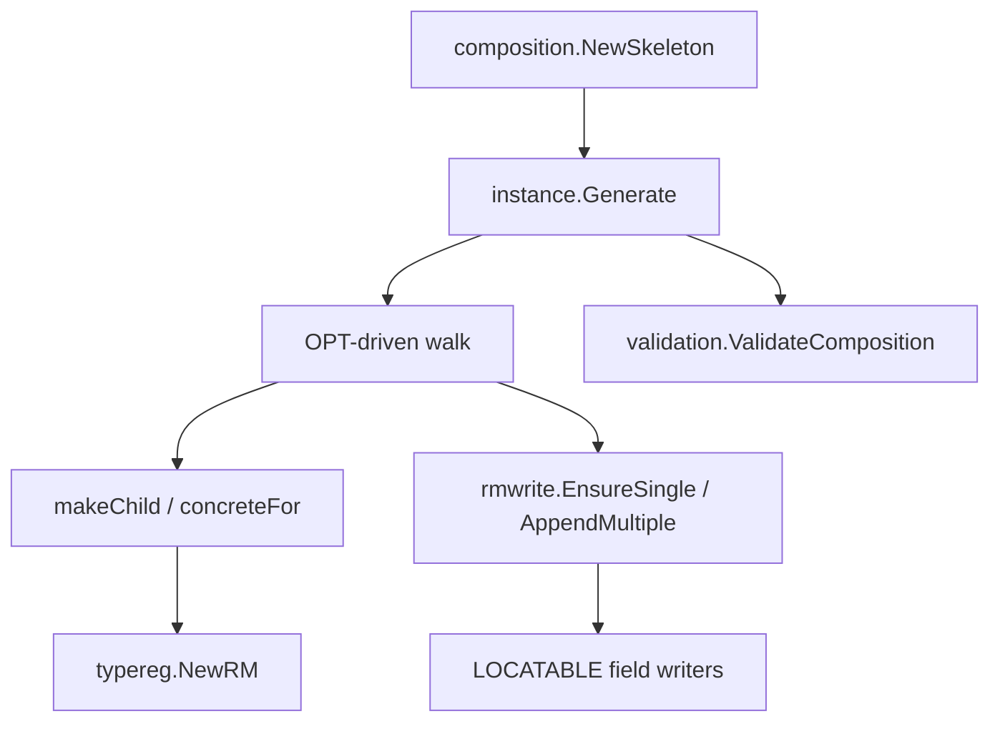

# Plan — Close SDK-GAP-12 (`NewSkeleton` real-world OPT coverage)

**Date:** 2026-06-19  
**Status:** Landed  
**Owner:** SDK maintainers  
**Covers:** [REQ-107](../specifications/clinical-modeling.md#req-107--template-driven-rm-instance-example-generator), [REQ-101](../specifications/clinical-modeling.md#req-101--generic-opt-driven-composition-builder), [REQ-103](../specifications/clinical-modeling.md#req-103--primitive-constraint-example-values) (interval leaves), [REQ-110](../specifications/clinical-modeling.md#req-110--validation-v2) (soundness contract)  
**Probes:** [PROBE-027](../specifications/conformance.md#probe-027--generated-instance-validates-clean) — extend corpus after fixes  
**Implementation:** landed  
**Depends on:** v0.9.0 public `templatecompile.Compile` bridge (landed)  
**Consumer:** a consuming CDR project — `TestNewSkeleton_CorpusCoverage` tripwire; closes when `newSkeletonGaps` allow-list shrinks to empty  
**External reference:** the consuming CDR project's SDK-GAP-12 draft (tracked in that project).

## Goal

`composition.NewSkeleton` (via `instance.Generate` + `rmwrite`) MUST produce a `*rm.Composition` that passes `validation.ValidateComposition` for every OPT that `templatecompile.Compile` accepts — including the three real-world corpus fixtures filed in SDK-GAP-12.

## Gap confirmation (reproduced 2026-06-19 on `main` @ fe79feb)

Worktree: `.worktrees/sdk-gap-12` (`feat/sdk-gap-12-newskeleton`). Corpus coverage lives in `testkit/probes/instance/probes_test.go` (`TestProbe027_GAP12Corpus`).

| Fixture | Phase | Observed error (matches poc PR #31) |
|---|---|---|
| `Referral Request.v1.opt` | `NewSkeleton` | `attach ELEMENT.name: rmwrite: unknown attribute on parent: *rm.Element has no single attr "name"` |
| `Demonstration.v1.opt` | `NewSkeleton` | `makeChild DV_INTERVAL<DV_QUANTITY>: rmwrite: unknown RM type: "DV_INTERVAL<DV_QUANTITY>"` |
| `social.opt` | `ValidateComposition` | `rm_type_mismatch: RM type EVALUATION does not satisfy template RM type OBSERVATION at /content[at0000]` |

`Demonstration.v1.opt` is already vendored under `testkit/cassettes/templates/`. The other two OPTs live in the poc benchmark corpus (`cmd/benchmark/internal/fixtures/templates/`); vendoring them (or minimal extracted slices) is part of Task 5.

**Note:** `social.opt` uses root `<OPERATIONAL_TEMPLATE>` (NightShift export). The SDK parser expects `<template>` per `openehr/template/parse.go` — poc normalises via tag rewrite before `ParseOPT`. Consider a small **out-of-scope** follow-up to accept both roots natively (REQ-100); this plan only needs the normaliser in tests until then.

## Architecture

Three independent defects in the synthesis stack; fix in dependency order (rmwrite → generic RM resolution → generator cardinality/selection):



1. **LOCATABLE `name` on `ELEMENT` (and peers)** — `applyLocatableIdentity` stamps `name` at construction, but the walk also materialises OPT-pinned `name` attributes and routes them through `rmwrite`. `writeElementSingle` only handles `value` / `null_flavour` / `null_reason`; `name` is missing. Same audit needed for `CLUSTER` (`writeClusterSingle` rejects all singles) and any other LOCATABLE writer that omits inherited LOCATABLE attrs.
2. **BMM generic RM types on the wire** — OPTs declare `DV_INTERVAL<DV_QUANTITY>` (angle brackets). `makeChild` passes the string verbatim to `typereg.Lookup`, which only registers `DV_INTERVAL` → `DVInterval[DVOrdered]`. Need a shared `resolveRMType(optDeclared string) string` that parses generic instantiations and maps to the concrete Go typereg key / constructor.
3. **Multi-valued attribute synthesis vs validation** — `materialiseMultiple` emits **one instance per OPT child** even when `occurrences.lower == 0`, ignoring `cardinality.upper` until append time. `social.opt` `content` has `upper: 1` and many optional archetype roots sharing `node_id=at0000` (mixed `OBSERVATION` + `EVALUATION`). Generator appends multiple items; validator binds `/content[at0000]` to the first OBSERVATION OPT child via `matchChildByID` node-id fallback → `rm_type_mismatch` on the EVALUATION instance. **Fix:** under `Policy: Minimal`, respect attribute `cardinality.upper` as a hard cap during planning (not only at append), and when only one slot is allowed materialise **one** child — the first OPT child whose `rm_type_name` / archetype id fits the attribute (same preference order as validation's `matchChildByID`).

## File structure

| File | Responsibility |
|---|---|
| `internal/templateinstance/rmwrite/write.go` | Add `name` (and `archetype_node_id` if ever walked) to `writeElementSingle`; audit `writeClusterSingle` / other LOCATABLE singles |
| `internal/templateinstance/rmwrite/write_test.go` | Table test: `EnsureSingle` on `*rm.Element` for `name` ← `*rm.DVText` |
| `openehr/instance/rmtype.go` (create) | `resolveRMType(declared string) (typeregKey string, err error)` — parse `DV_INTERVAL<T>`, `HISTORY<T>`, etc. |
| `openehr/instance/rmtype_test.go` (create) | Cases: `DV_INTERVAL<DV_QUANTITY>`, `DV_INTERVAL<DV_COUNT>`, passthrough `DV_TEXT`, unknown → error |
| `openehr/instance/generate.go` | Use `resolveRMType` in `makeChild` / `materialiseImplicit*`; fix `materialiseMultiple` upper-bound + single-child selection |
| `openehr/instance/generate_test.go` (extend) | Unit tests for cardinality-cap + first-child selection without full OPT |
| `openehr/template/constraints/` (maybe) | `ExampleValue` for interval primitive constraints if REQ-103 lacks one — check `Test_dv_interval_dv_quantity_*.opt` cassettes first |
| `testkit/cassettes/templates/` | Add `Referral Request.v1.opt`, `social.opt` (or slim fixtures) |
| `testkit/probes/instance/` | Extend PROBE-027 or add `TestProbe027_GAP12Corpus` |

## Implementation checklist

### Task 1: `rmwrite` LOCATABLE `name` on `ELEMENT`

**Files:**
- Modify: `internal/templateinstance/rmwrite/write.go` (`writeElementSingle`)
- Test: `internal/templateinstance/rmwrite/write_test.go`

- [x] **Step 1: Failing test** — `EnsureSingle(elem, "ELEMENT", "name", &rm.DVText{Value: "foo"})` succeeds.
- [x] **Step 2: Implement** — add `case "name":` accepting `rm.DVText` / `*rm.DVText` (mirror `writeObservationSingle` patterns if present; otherwise follow `writeCluster` LOCATABLE field typing from `applyLocatableIdentity`).
- [x] **Step 3: Audit** — grep `writeClusterSingle`, `writeItemTreeSingle`, etc. for the same gap; fix if OPT walk can reach them with explicit `name` pins.
- [x] **Step 4: Run** — `go test ./internal/templateinstance/rmwrite/...`
- [x] **Step 5: Repro** — Referral case passes generation.

### Task 2: Generic RM type resolution (`DV_INTERVAL<T>`)

**Files:**
- Create: `openehr/instance/rmtype.go`, `openehr/instance/rmtype_test.go`
- Modify: `openehr/instance/generate.go` (`makeChild`, `materialiseImplicitSingle`, `materialiseImplicitMultiple`)

- [x] **Step 1: Failing tests** — `resolveRMType("DV_INTERVAL<DV_QUANTITY>")` → typereg key that constructs `*rm.DVInterval[rm.DVQuantity]`; same for `DV_COUNT`, `DV_DATE_TIME`; bare `DV_INTERVAL` → `DV_INTERVAL` (ordered bound).
- [x] **Step 2: Implement parser** — strip whitespace; regex or strings.Cut on `<` `>`; map inner type to typereg name; delegate unknown generics as `ErrUnknownRMType`.
- [x] **Step 3: Wire `makeChild`** — `rmType := resolveRMType(child.RMTypeName())` before `rmwrite.NewRM`.
- [x] **Step 4: Primitive defaults** — ensure `populatePrimitiveDefault` / `applyPrimitiveExample` handle `*rm.DVInterval[rm.DVQuantity]` (add sentinel lower/upper magnitudes if REQ-103 ExampleValue exists on interval constraints; else minimal zero interval).
- [x] **Step 5: Run** — `go test ./openehr/instance/...`
- [x] **Step 6: Repro** — Demonstration case passes generation.

### Task 3: `materialiseMultiple` cardinality + child selection (`social`)

**Files:**
- Modify: `openehr/instance/generate.go` (`materialiseMultiple`, possibly extract `pickMinimalChildren(attr, children) []*CompiledNode`)
- Test: `openehr/instance/generate_test.go`

- [x] **Step 1: Failing unit test** — social.opt integration test asserts one content entry of type `*rm.Observation`.
- [x] **Step 2: Implement cap-aware planning** — compute `maxItems` from `attr.ChildMultiplicity().Upper()` when bounded; stop iterating OPT children once `total == maxItems`.
- [x] **Step 3: Minimal optional children** — optional sibling `node_id` collision dedup under Minimal (first sibling wins).
- [x] **Step 4: RM type consistency** — first colliding optional sibling aligns with validation bind order.
- [x] **Step 5: Run** — `go test ./openehr/instance/...`
- [x] **Step 6: Repro** — social case: `NewSkeleton` + `ValidateComposition` OK.

### Task 4: Soundness gate (PROBE-027 extension)

**Files:**
- Modify: `testkit/probes/instance/probes_test.go` (or new `gap12_corpus_test.go` in same package)
- Modify: `docs/specifications/traceability.yaml` if new test files added

- [x] **Step 1: Add corpus helpers** — `parseOPTBytes` normaliser (OPERATIONAL_TEMPLATE → template) in `testkit/fixtures` if reused; avoid duplicating poc's private helper.
- [x] **Step 2: Extend PROBE-027** — run `Probe027GeneratedValidates` on `Referral Request.v1`, `Demonstration.v1`, `social` with stable composer/territory.
- [x] **Step 3: Run** — `go test ./testkit/probes/instance/...`

### Task 5: Docs & consumer handshake

- [x] **Step 1:** Add brief note under REQ-107 in `docs/specifications/clinical-modeling.md` — generator MUST respect attribute cardinality upper under Minimal policy; generic OPT RM types MUST resolve.
- [ ] **Step 2:** `CHANGELOG.md` — one bullet under `### Added` / `### Fixed` (on release request only).
- [ ] **Step 3:** Notify poc — after SDK release, poc PR #31 `newSkeletonGaps` shrinks; consumer re-runs `TestNewSkeleton_CorpusCoverage`.
- [x] **Step 4:** `make spec-check` + `make ci` in worktree.

## Verification

```bash
# From worktree root
go test ./internal/templateinstance/rmwrite/... ./openehr/instance/... ./openehr/composition/... ./testkit/probes/instance/...
make ci   # full gate when Docker available
```

**Acceptance (matches SDK-GAP-12):** for all three fixtures, `templatecompile.Compile` + `composition.NewSkeleton` + `validation.ValidateComposition(...).OK == true`.

## Out of scope

- **Payload realism** — Minimal policy skeletons stay smaller than poc curated fixtures; benchmark adoption is a consumer decision.
- **Native `<OPERATIONAL_TEMPLATE>` root parsing** — test normaliser only; optional REQ-100 follow-up.
- **`Example` policy** emitting all optional sections — only Minimal behaviour changes for cardinality.

## Risks

| Risk | Mitigation |
|---|---|
| Generic type parser drift vs BMM | Table-test every `DV_INTERVAL<*>` variant in typereg; defer `HISTORY<T>` until an OPT needs it |
| Fixing cardinality breaks `vital_signs` PROBE-027 | Run full probe suite after Task 3; vital_signs has multiple distinct content children with unique archetype ids |
| `name` write duplicates `applyLocatableIdentity` | Acceptable — last write wins; prefer skipping explicit `name` walk when already stamped (optional optimisation) |

## Suggested commit sequence

1. `fix(rmwrite): allow ELEMENT.name attachment`
2. `fix(instance): resolve DV_INTERVAL generic RM types from OPT`
3. `fix(instance): respect cardinality upper in Minimal materialiseMultiple`
4. `test(probes): extend PROBE-027 for SDK-GAP-12 corpus`
